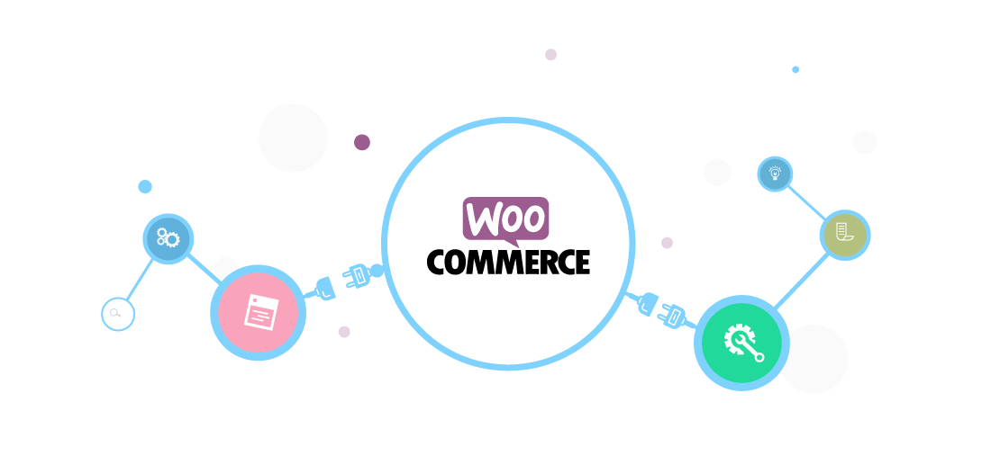

# Welcome to the E Commerce Woo Plugin WordPress

## What is the E Commerce Woo Plugin WordPress?

Used to add woocommerce support to themes using after_setup_theme command

## Getting Started

Getting started with the XYZ Plugin is a breeze:

1. **From the WooCommerce Plugin's Pages -> Visit Shop Page:** Görünüm & Menüler Shop - Shop Page.

## Installation

The "templates" folder in the WooCommerce Plugin installation files is copied to the "themes" folder and the folder's name is changed to "woocommerce".
